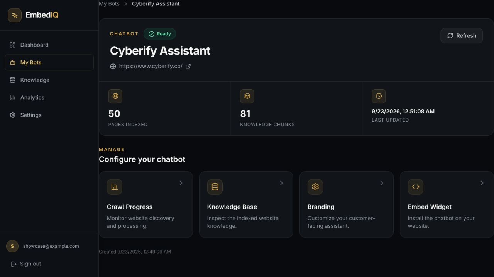
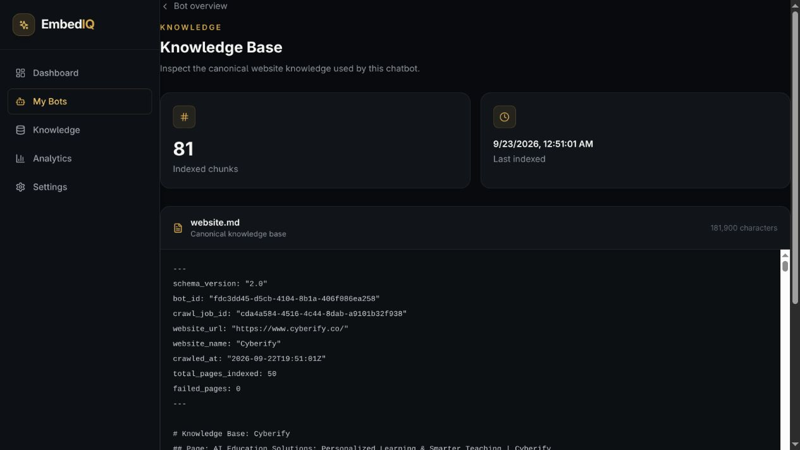
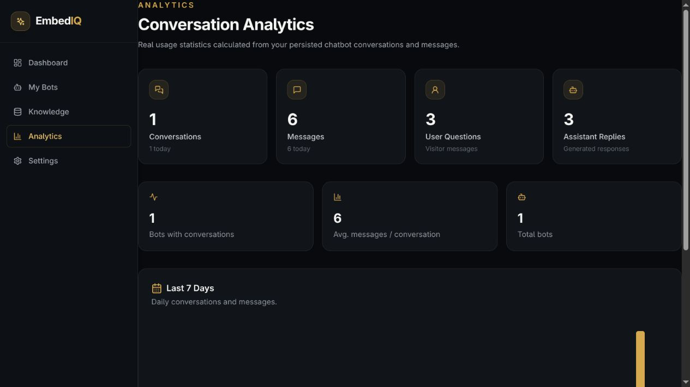
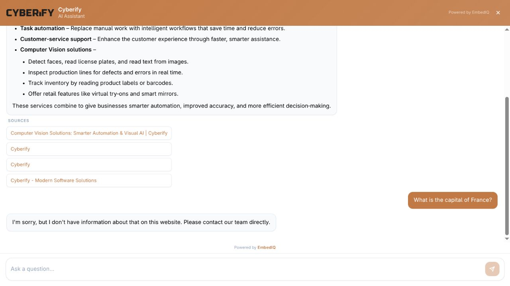

# EmbedIQ

> Turn a website into a searchable knowledge base and an embeddable AI chat
> experience—without building a chatbot stack from scratch.

EmbedIQ is an embeddable, website-specific RAG chatbot platform. It crawls a
website, builds a searchable knowledge base, and exposes a chat widget that
answers questions using the site's content.

The repository contains a FastAPI backend, a Next.js dashboard and widget, and
PostgreSQL/pgvector plus Redis services for persistence, vector search, and
background jobs.

## Product preview

### Website assistant overview



### Indexed knowledge base



### Conversation analytics



### Widget guardrail check



## Repository layout

| Path | Purpose |
| --- | --- |
| `backend/` | FastAPI API, database models, migrations, crawler, RAG, and Celery tasks |
| `frontend/` | Next.js dashboard, chat widget, and browser embed script |
| `docs/` | Maintainer-oriented architecture and development notes |
| `docker-compose.yml` | Local PostgreSQL/pgvector and Redis development services |
| `.env.example` | Configuration template; copy it to `.env` locally |

## Prerequisites

- Python 3.11+
- Node.js 18+
- Docker and Docker Compose
- An OpenAI-compatible embedding/LLM provider, unless using local providers

## Quick start

```bash
git clone https://github.com/HaiderNaqvi-5/EmbedIQ.git
cd EmbedIQ
cp .env.example .env
```

Review `.env` and replace all placeholder secrets and provider credentials.
Never commit `.env` or any production credentials.

Start the infrastructure:

```bash
docker compose up -d postgres redis
```

Run the backend:

```bash
cd backend
python -m venv .venv
source .venv/bin/activate
pip install -r requirements.txt
alembic upgrade head
uvicorn app.main:app --reload --port 8000
```

Run the frontend in a second terminal:

```bash
cd frontend
npm ci
npm run dev
```

The dashboard is available at `http://localhost:3000`, and the API is
available at `http://localhost:8000`. FastAPI's interactive documentation is
at `http://localhost:8000/docs`.

For background crawling and indexing, start a worker from `backend/`:

```bash
celery -A app.jobs.celery_app worker --loglevel=info -c 4
```

## Product flow

1. Create a brand and chatbot configuration in the dashboard.
2. Crawl a site or add documents to build a scoped knowledge base.
3. Index content into pgvector and use retrieval-grounded answers in the widget.
4. Embed the generated script on the target site and review conversations from
   the dashboard.

The API, dashboard, widget, crawler, retrieval service, and background worker
live in this repository so the complete local development workflow is visible
in one place.

## Cyberify validation run

EmbedIQ was exercised against `https://www.cyberify.co/` with the configured
50-page crawl cap: all 50 pages completed successfully and produced 81 indexed
knowledge chunks. A Cyberify services and computer-vision question returned a
grounded answer with source links, while an unrelated question ("What is the
capital of France?") was rejected with the website-scoped fallback.

## Testing

Backend tests:

```bash
cd backend
pytest
```

Frontend production build:

```bash
cd frontend
npm run build
```

## Documentation

- [Backend guide](backend/README.md)
- [Frontend guide](frontend/README.md)
- [Architecture and development notes](docs/README.md)

## Security and repository hygiene

Generated dependencies, caches, local databases, backups, and environment
files are intentionally excluded by `.gitignore`. If a secret is exposed,
rotate it immediately; removing it from a later commit does not invalidate the
credential.
